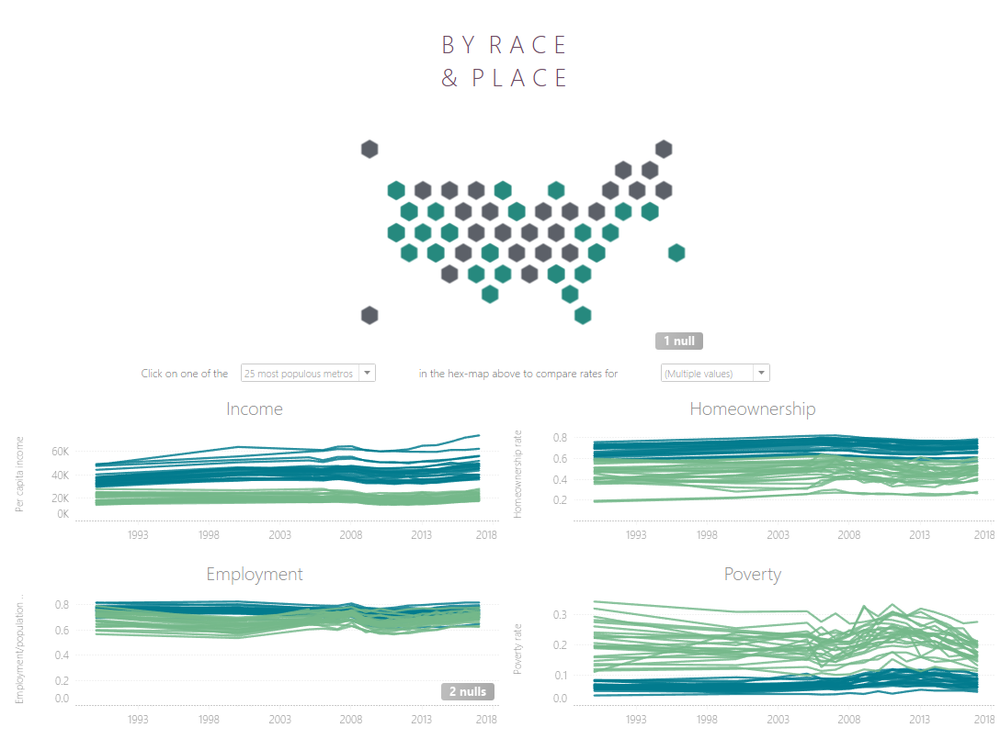
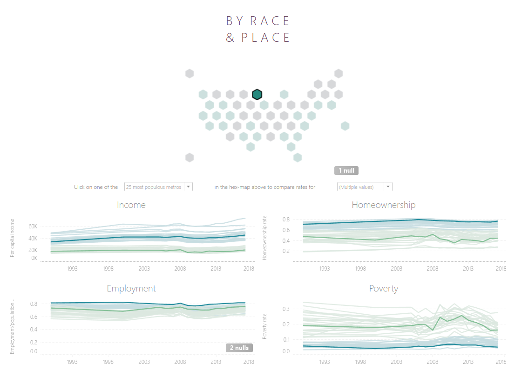
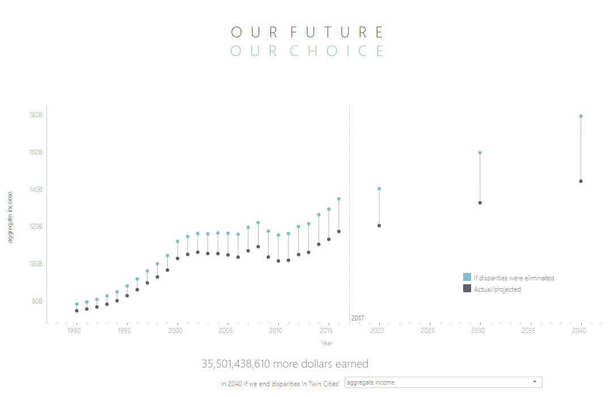

# Disparity Data For Twin Cities and Peer Regions

Code contained in this repo helped expand the first version of this visualization (seen below) to include age disaggregation and disability disaggregation.  The visualization helps inform Metropolitan Council members on trends within the region as they make policy decisions.

# Contributors
* Nicole Sullivan (nicole.sullivan@metc.state.mn.us)
* Liz Roten (liz.roten@metc.state.mn.us)
* Matt Schroeder (matt.schroder@metc.state.mn.us)
